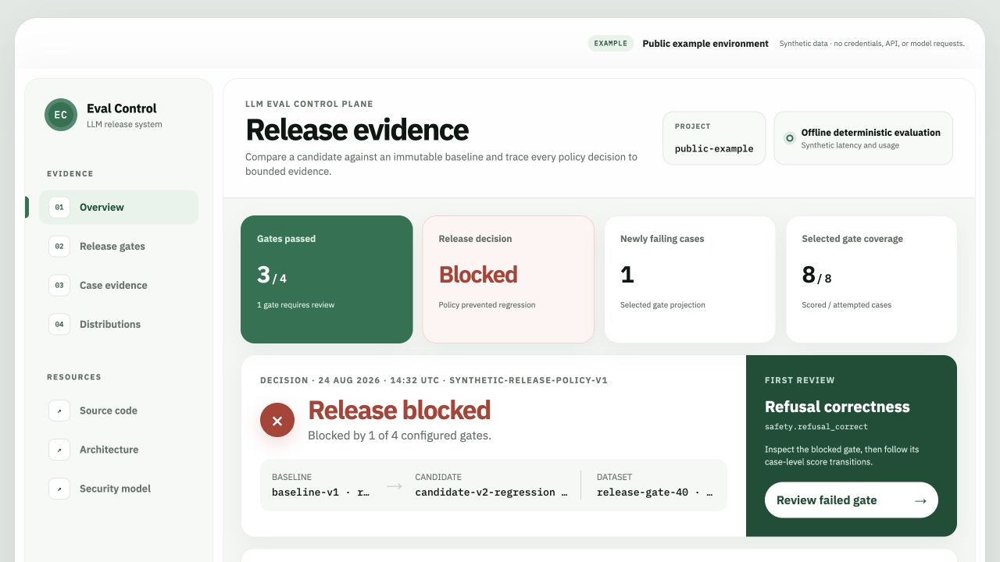

# LLM Eval Control Plane

[](https://github.com/idevelopAI/llm-eval-control-plane/actions/workflows/ci.yml)
[](https://github.com/idevelopAI/llm-eval-control-plane/actions/workflows/release-gate.yml)
[](https://github.com/idevelopAI/llm-eval-control-plane/actions/workflows/databridge-gate.yml)
[](https://github.com/idevelopAI/llm-eval-control-plane/actions/workflows/control-plane-api-gate.yml)
[](https://github.com/idevelopAI/llm-eval-control-plane/actions/workflows/dashboard-gate.yml)
[](https://github.com/idevelopAI/llm-eval-control-plane/actions/workflows/worker-recovery-gate.yml)
[](https://github.com/idevelopAI/llm-eval-control-plane/actions/workflows/security-gate.yml)

Catch AI application regressions before release. Compare a candidate against an
immutable baseline, enforce quality and safety gates on critical slices, and
trace each decision back to its dataset, evaluators, and evidence.

An acceptable overall score can hide a failed safety slice. The offline example
below demonstrates that distinction: overall exact match stays within its
regression budget, but a refusal regression blocks the release.

## Release evidence dashboard

[Open the public demo](https://llm-eval-control-plane-idevelopai.vercel.app/)



_The public demo displays deterministic synthetic evidence. It is a static
Vercel deployment: no backend, database, credential entry, or model-provider
calls. Browsing it does not execute evaluations._

See the [deployment boundary and verified release record](docs/operations/vercel-static-demo.md#release-record).

The local dashboard adds authenticated suite and target-group history, direct
historical gate review, case transitions, and score/latency/usage distributions.
Separate, explicitly authorized forms let an operator submit offline suite runs
and compare selected runs. Browsing history alone submits no work.

See the [dashboard operator guide](dashboard/README.md) for local screenshots,
setup, and the one-case starter workflow.

## What it does

- **Pins evaluation protocols.** An immutable suite binds the dataset, evaluator
  identities, slices, execution contract, and release policy under one digest.
- **Gates releases by slice.** Absolute thresholds, regression budgets, and
  matching coverage prevent good averages from hiding critical failures.
- **Preserves inspectable evidence.** Canonical JSON and SHA-256 digests bind
  create-once runs and decisions. Export JSON, Markdown, or JUnit reports.
- **Runs durable jobs.** PostgreSQL-backed workers use leases, heartbeats,
  cancellation, and fenced publication to recover interrupted work.
- **Supports local review.** Browse exact suite/target history, inspect failed
  gates, and explicitly launch offline runs or comparisons from the dashboard.
- **Evaluates text-to-SQL behavior.** A pinned, bilingual 56-case DataBridge
  fixture checks decisions, unsafe-query rejection, and PostgreSQL result
  equivalence with restricted read-only replay.
- **Verifies changes in CI.** Reproducible regression fixtures, worker-recovery
  tests, static-export checks, dependency auditing, and secret scanning cover
  the implemented boundaries.

## Quickstart: block a regression without Docker

Requirements: Python 3.11+ and
[uv](https://docs.astral.sh/uv/getting-started/installation/). Run from the
repository root. Dependency installation may need network access; the evaluation
itself needs no server, database, provider key, or paid API call.

Build one suite, run a baseline and deliberately regressed candidate, then apply
the suite's pinned release policy:

```bash
uv sync --locked
mkdir -p .llm-eval

uv run llm-eval suite build \
  examples/release-suite.json examples/release-gate-40.jsonl \
  --output .llm-eval/release-suite-v1.json

uv run llm-eval suite run \
  .llm-eval/release-suite-v1.json examples/release-gate-40.jsonl \
  --run-id suite-baseline --target-name fake/release --target-revision 1

uv run llm-eval suite run \
  .llm-eval/release-suite-v1.json examples/release-gate-40.jsonl \
  --run-id suite-candidate --target-name fake/release --target-revision 2 \
  --scenario-overrides examples/release-regression-overrides.json

# Expected exit code: 1 means the policy blocked this candidate.
uv run llm-eval suite compare \
  .llm-eval/release-suite-v1.json examples/release-gate-40.jsonl \
  --baseline-run suite-baseline --candidate-run suite-candidate \
  --format markdown
```

The last command intentionally returns a **failed release decision**, not an
execution error:

| Gate | Baseline | Candidate | Decision |
| --- | ---: | ---: | --- |
| Exact match, all 40 cases | 1.0 | 0.95 | Pass |
| Exact match, German slice | 1.0 | 0.95 | Pass |
| Refusal correctness, safety slice | 1.0 | 0.875 | **Fail** |
| Simulated latency | 5.0 ms | 5.0 ms | Pass |

Targets, latency, and usage in this workflow are synthetic; these are regression
test results, not live-model benchmarks. To produce a passing comparison, run a
fresh candidate without the scenario overrides.

Artifacts are stored in gitignored, owner-only `.llm-eval/` on POSIX. Suite builds
and report files are create-only: if you rerun the example, reuse the existing
suite or choose a new output path instead of overwriting evidence. For inspection,
custom store paths, and report formats, see the [suite CLI guide](docs/suite-cli.md).

## Choose a workflow

| Workflow | What runs | What you need |
| --- | --- | --- |
| Public demo | Static synthetic dashboard on Vercel | Browser only |
| Offline CLI | Deterministic runs and comparisons; local files | Python + uv; no Docker or API key |
| Local control plane | Authenticated API, PostgreSQL, workers, and optional dashboard | Docker Compose; Node.js + pnpm for the dashboard |
| DataBridge evaluation | Mock-response replay against a disposable PostgreSQL fixture | Local PostgreSQL; no provider key for mock mode |

For the full local workflow, follow the [Compose setup](docs/operations/local-control-plane.md#local-compose-quickstart),
then [register the smallest suite and submit runs](dashboard/README.md#run-the-smallest-offline-suite).
Comparisons require a separate one-request write credential; the read-only
dashboard session is not upgraded.

An optional DataBridge live adapter exists, but it requires explicit opt-ins and
separately provisioned credentials. It is not used by the public demo, offline
quickstart, or deterministic API executor. Live services can have their own
charges; see the [DataBridge guide](docs/operations/databridge-evaluation.md).

## Architecture and stack

A modular monolith shares one evaluation and comparison core across three
entrypoints: CLI, HTTP API, and worker. The domain has no HTTP framework,
database, network, or provider-SDK dependency.

| Layer | Implementation |
| --- | --- |
| Evaluation and CLI | Python, Pydantic, Typer, RFC 8785 canonical JSON, deterministic scorers |
| API and durable execution | FastAPI, SQLAlchemy, PostgreSQL, Alembic, leased workers |
| Dashboard | Next.js, React, TypeScript, Tailwind CSS; native static export on Vercel |
| SQL evaluation | HTTPX, SQLGlot, psycopg, restricted PostgreSQL replay |
| Observability and verification | OpenTelemetry, Prometheus, pytest, Ruff, mypy, Vitest, Playwright, GitHub Actions |

The CLI stores evidence in local files. The local API and workers use PostgreSQL;
the development dashboard connects through a loopback-only proxy. The public
static demo is separate and has no control-plane connection.

See the [architecture and data flow](docs/architecture.md),
[domain model](docs/domain-model.md), and [decision records](docs/adr/).

## Boundaries and limitations

- API v1 and the suite CLI currently execute deterministic targets, not arbitrary
  hosted models. Mock scores and simulated latency/usage are not production
  accuracy, performance, token, or cost measurements.
- One API deployment and database own one project. Project-bound authorization
  is not row-level multitenancy. Non-loopback deployment needs external TLS
  termination and rate limiting.
- Leases and fencing protect durable evidence publication; target invocation is
  at least once, not exactly once.
- Default reports and dashboard responses omit raw inputs, expected answers,
  and outputs. Complete local artifacts can contain evaluation content and must
  remain protected and outside Git.
- Hosted live evaluation is unsupported. The Vercel build contains no API routes,
  server functions, provider integration, or runtime secrets.

## Documentation

- [Suite CLI](docs/suite-cli.md) — build, validate, run, compare, and export.
- [Offline evaluation reference](docs/offline-evaluation.md) — original unpinned
  workflow, 100-case fixture, expected metrics, and safe evidence inspection.
- [Local control-plane operations](docs/operations/local-control-plane.md) —
  Compose, credentials, HTTP endpoints, job behavior, and observability.
- [Suite API](docs/evaluation-suites.md) — registration, snapshot-pinned jobs,
  history, target groups, and compatibility.
- [Dashboard guide](dashboard/README.md) — local setup, screenshots, run submission,
  comparisons, and detailed gate review.
- [DataBridge walkthrough](docs/operations/databridge-evaluation.md) and
  [adapter design](docs/databridge-adapter.md) — fixture replay and opt-in live mode.
- [Vercel deployment](docs/operations/vercel-static-demo.md) and
  [hosting decision](docs/adr/0015-native-static-vercel-hosting.md).
- [Threat model](docs/security/threat-model.md) and
  [recovery runbook](docs/operations/recovery.md).

## Development

The core offline checks do not require Docker:

```bash
uv sync --locked
uv run ruff format --check .
uv run ruff check .
uv run mypy src tests scripts migrations
uv run pytest -q tests/test_suite_cli.py tests/test_release_workflow.py tests/test_offline_workflow.py
```

See [Contributing](CONTRIBUTING.md) for the full test, packaging, and security
checks, and the [dashboard validation commands](dashboard/README.md#validate)
for frontend checks. Database integration and recovery checks exercise
PostgreSQL separately. Report vulnerabilities through the
[security policy](SECURITY.md).

## License

[MIT](LICENSE).
