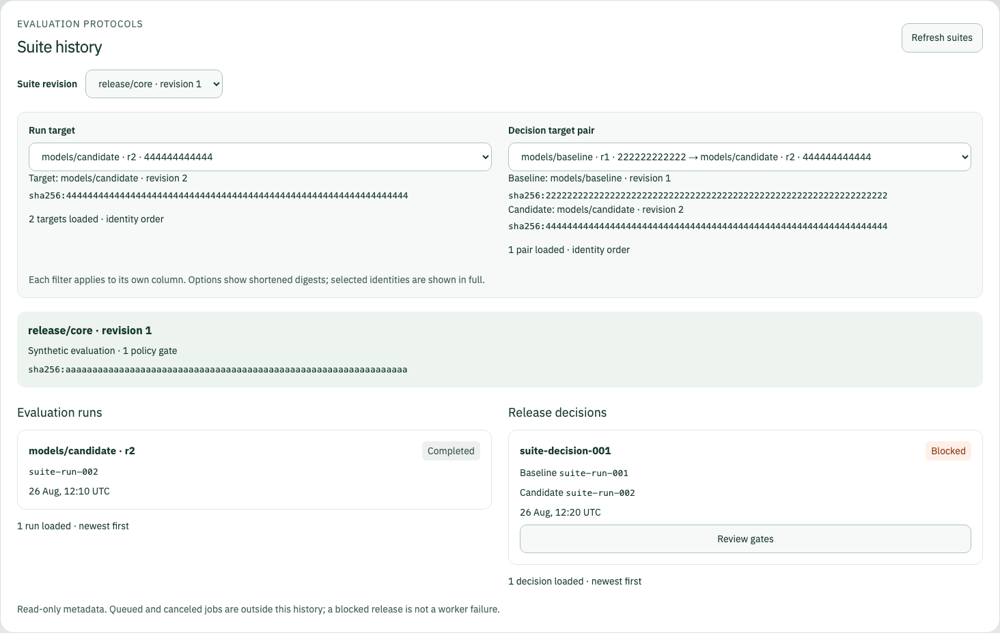

# Release evidence dashboard

This dashboard turns immutable release decisions into a bounded review surface:
gate outcomes, score-only case transitions, and aggregate score, latency, and
usage-unit distributions. It never requests or renders prompts, expectations,
target outputs, SQL, rows, provider responses, or exception text.

## Data-source modes

The initial **fixture** mode is deterministic and makes no API requests. It is
safe for a public example environment and is always labeled as synthetic data.

The production homepage imports a dedicated fixture-only component. API client,
credential, live-mode, and loopback-proxy modules are absent from its client and
server-rendered application chunks. Development resolves the homepage to the
local live-capable component only while `vinext dev` is running; production
builds do not use that development substitution.

The **local live** mode is available only when the dashboard itself is served
over plain HTTP on `localhost`, `127.0.0.1`, or `[::1]`. It connects through the
same-origin Vite proxy to an explicit loopback control-plane origin. A hosted
origin never renders the bearer-entry form.

Live mode supports:

- the newest 20 immutable release decisions, ordered newest first;
- decision and gate selection with cancellation of superseded requests;
- explicitly opened suite history for a selected immutable protocol revision,
  showing completed run metadata and release decisions pinned to its digest;
- independent exact-target and directed baseline/candidate-pair history filters;
- transition filters over redacted case evidence;
- cursor-based case pagination, bounded to 100 cases per request and 500 cases
  retained by the browser view;
- fixed score and operational distributions, with small operational samples
  suppressed by the API; and
- explicit loading, empty, authorization, network, and inconsistent-evidence
  states without silently substituting fixture data. A non-authorization failure
  in the case or distribution projection leaves the successful sibling visible
  and gives the failed panel its own retry action.

### Browse suite history

After connecting to the local API, select **Browse suite history**. Select a
registered **Suite revision** to inspect its exact digest, execution mode, gate
count, evaluated target revisions, and baseline/candidate run IDs. The panel
does not fetch case content, execute evaluations, or select a baseline.

Catalog, run, and decision pages load 20 records at a time and retain at most 100
records each. Use **Load more suites**, **Load older runs**, or **Load older
decisions** explicitly; the panel does not poll or prefetch. Runs and decisions
are ordered newest first, preserving timestamp microseconds and ID tie-breaks.
Older records remain available through the authenticated API after the display
limit. **Refresh suites** resets the view and loads the current first pages.

Unpinned legacy evidence, queued jobs, and canceled jobs are outside suite
history. A **Blocked** release means policy failed, not that its worker failed.
Empty, loading, and retry states never substitute synthetic evidence for a live
response. Invalid ordering, duplicate IDs, inconsistent suite pins, or repeated
cursors fail closed; a pagination failure preserves already verified records.
Changing revisions aborts superseded reads. Any `401`/`403` clears both history
and the release view and requires a new local connection.

Select **Review gates** on a release decision to open its detailed review,
including decisions outside the newest 20. Before requesting case or distribution
evidence, the client checks the selected row against the decision ID, digest,
status, timestamp, baseline/candidate run IDs, and complete suite pin. It then
opens the first failed gate (or first gate when all pass), resets the case filter,
and focuses the review surface. The detailed view keeps the existing redacted
case and aggregate-only distribution boundaries.

The recent-decision picker remains bounded to its original collection plus, at
most, the currently selected historical decision. An older selection is labeled
**Suite history**; choosing a recent decision removes the extra option. Opening
another row cancels the prior request. A missing or inconsistent historical
decision preserves the previous verified review with an explicit error; retry
through that row. Authorization failure clears both panels immediately.

History rows remain metadata-only until explicitly opened. The hosted synthetic
dashboard has no suite browser and makes no suite API requests.

### Filter history by target

Opening a suite also loads the first [target and target-pair group
pages](../docs/evaluation-suites.md#target-grouped-history) for that exact suite.
Choose **Run target** to filter evaluation runs, or **Decision target pair** to
filter release decisions. These filters are independent: filtering runs does not
implicitly choose a comparison baseline. **All targets** and **All baseline →
candidate pairs** restore their respective suite-wide histories.

Selections bind the complete name, revision, and digest; the same name and
revision with different digests remain different options. Option labels shorten
digests, extending them to disambiguate loaded options. Selected pins are shown
in full. Pair direction matters: A → B and B → A are separate groups. Only
pairs observed in persisted comparisons are offered, not every possible target
combination.

Group pages load 20 records at a time, in bytewise name, numeric revision, and
digest order (baseline first, then candidate for pairs). **Load more targets**
and **Load more pairs** explicitly extend their own catalogs, each capped at
100 groups. They do not reload history. Further groups remain available through
the API; loaded counts are not suite totals.

Changing either filter cancels pending metadata reads and reloads both history
columns from their first pages, preserving the other filter. Previous rows are
cleared while loading so they cannot appear under a new selection. Pagination
keeps the active full-identity filters; selecting a different suite or
**Refresh suites** resets both filters and all cursors. Failed pagination retains
already verified records; refresh to recover from an inconsistent cursor.

Group responses use strict runtime metadata allowlists, exact suite-pin checks,
and ordering/duplicate validation, including across pages. Filtered run responses
must match the requested target. The API enforces pair filtering; before loading
cases or distributions, **Review gates** additionally verifies the decision's
resolved baseline and candidate against the selected pair. A mismatch leaves
the previous verified review visible with an error. Authorization failure on any
group or history read clears the entire local session.



_Captured from the local dashboard with intercepted synthetic test responses;
no real credential, provider, or hosted API is involved._

## Credential boundary

Use a project credential with only `control-plane:read`. The raw value stays in
one component-scoped closure for the lifetime of the tab. The dashboard does not
write it to local storage, session storage, cookies, URLs, React state,
logs, or rendered markup. Disconnecting, unmounting, or receiving `401`/`403`
drops the retained reference and aborts active reads.

The browser client sends credentials only to the same origin. Development proxy
configuration accepts only explicit loopback HTTP origins with a port. Responses
use `no-store`, redirects are rejected, referrers are suppressed, server error
messages are discarded, and successful JSON is checked against strict runtime
allowlists before it reaches the view model.

Hosted live access is intentionally unsupported in the public example. A later
hosted version requires the stateless, platform-authenticated backend-for-frontend
boundary described below; do not enable browser bearer entry on a public origin.

## Hosted build boundary

`pnpm run build` runs an artifact verifier after compilation. The verifier fails
if the live dashboard enters the public module graph; if application chunks
contain control-plane routes, credential markers, model-provider endpoints, or
browser persistence; if the output contains secrets, source maps, credential
files, gradients, or unexpected runtime bindings; or if a server-only prerender
secret reaches a client artifact.

`pnpm run smoke:public` starts the built runtime on a temporary loopback port,
checks the hardened response and non-cacheable fixture HTML, and proves that
GET, POST, HEAD, and OPTIONS requests against representative paths below `/api`
and `/v1` all resolve to 404. Together with the generated route-manifest check,
these gates verify the shipped artifact rather than relying only on source-level
origin checks. The accepted public-access and rollback policy is recorded in
[ADR 0011](../docs/adr/0011-public-example-site.md), with the exact deployed
artifact and unauthenticated review captured in the
[public Site release record](../docs/operations/public-site-release.md).

## Implemented disabled foundation

Tested server-only helpers now define the future hosted read boundary: platform
owner identity, private configuration, same-origin request provenance, four
allowlisted GET operations, bounded JSON reads, and strict response projection.
They are not connected to a runtime binding or application route, and no Site
secret is configured. The hosted dashboard remains a zero-request synthetic
example with no live behavior change.

Enabling these helpers requires verified server-only secret binding and request
dispatch in the production Worker runtime, a separately provisioned read-only
service token, withdrawal of public fixture access followed by reverified
owner-only private access, and explicit route adapters that deny every non-GET
method (including `HEAD` and `OPTIONS`).

## Run locally

Start the control-plane Compose stack first, including its project-bound
authentication configuration. Then install the locked frontend dependencies and
start the development server:

```bash
cd dashboard
pnpm install --frozen-lockfile
CONTROL_PLANE_DEV_ORIGIN=http://127.0.0.1:8000 pnpm dev
```

Open the loopback URL printed by the development server. Select **Use local live
data**, then enter the exact project ID and a read-only credential obtained from
your local secret manager. Do not put the credential in `.env`, a command,
source code, screenshots, test fixtures, or Git.

`CONTROL_PLANE_DEV_ORIGIN` defaults to `http://127.0.0.1:8000`. Any configured
value must remain an explicit HTTP loopback origin with a port.

## Validate

```bash
cd dashboard
pnpm run api:check
pnpm run lint
pnpm run typecheck
pnpm run test
pnpm run build
pnpm run smoke:public
```

The test suite includes runtime-contract rejection, credential non-persistence,
origin restrictions, stale-response cancellation, authorization clearing,
decision identity checks, isolated projection recovery, pagination boundaries,
automated accessibility checks for the major UI states, a solid-fill visual
contract, production artifact inspection, and built-runtime route probes.
