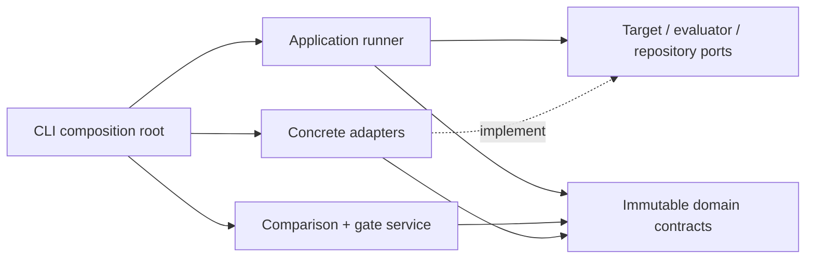
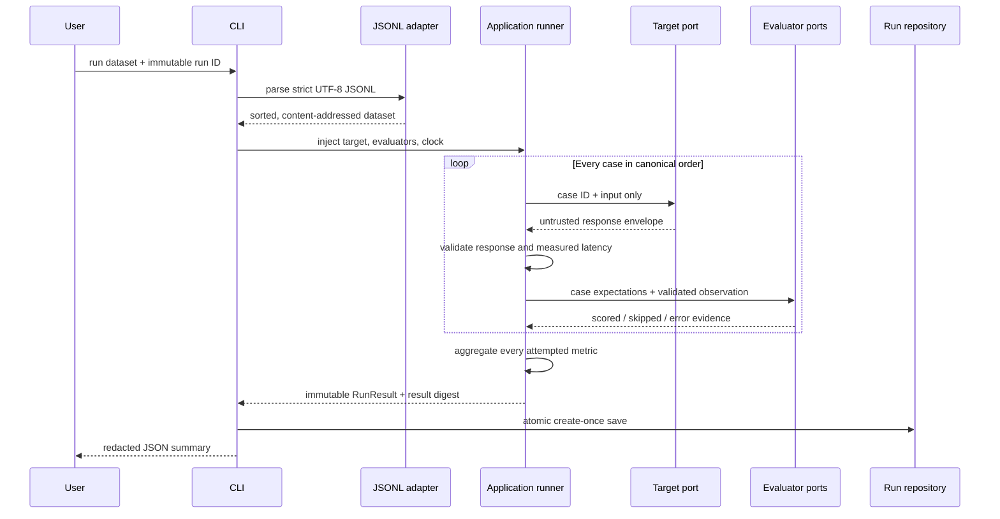
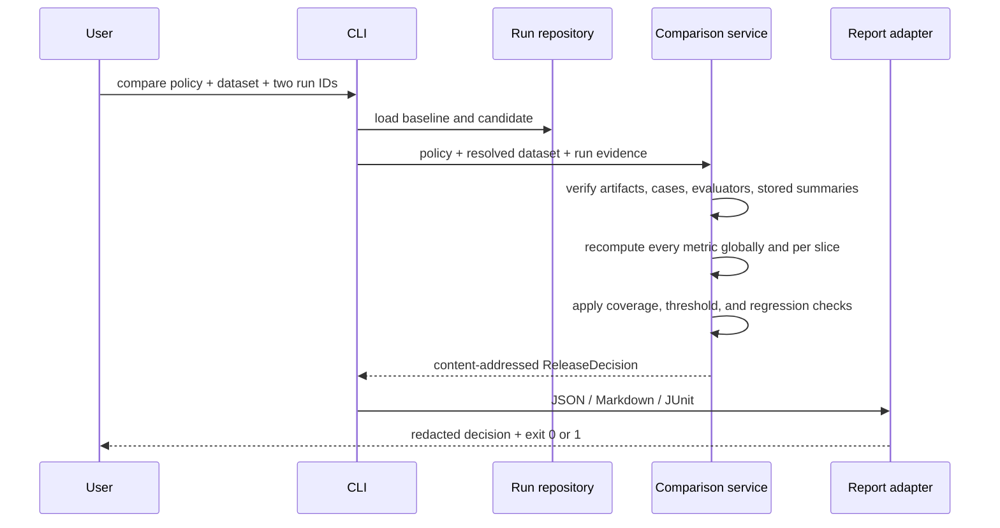
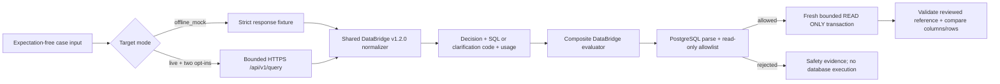

# Architecture

## System objective

LLM Eval Control Plane turns AI application behavior into reproducible evidence.
The implemented Phase 3 slice loads a content-addressed dataset, invokes a
versioned deterministic mock or explicitly enabled live target once per case,
validates untrusted responses, applies versioned evaluators, preserves case-level
outcomes, aggregates coverage-aware metrics, and atomically stores a complete
immutable run. It also aligns candidate and baseline evidence, recomputes global
and slice aggregates, applies release policy, and renders a content-addressed
decision. The DataBridge vertical slice adds strict HTTP normalization, SQL
safety policy, and bounded read-only PostgreSQL replay without weakening the
provider-neutral application ports.

## Architectural style

The project is a modular monolith. The CLI is the composition root: it constructs
concrete adapters and passes them into application-owned protocol ports.



The compile-time dependency rule is:

```text
entrypoints and adapters -> application -> domain
```

The application layer does not import concrete adapters. The domain does not
import CLI, persistence, network, telemetry, queue, database, or provider SDKs.

## Implemented structure

```text
src/llm_eval_control_plane/
├── cli.py
├── application/
│   ├── ports.py           # target, evaluator, and run-repository protocols
│   ├── runner.py          # serial in-process orchestration and aggregation
│   └── comparison.py      # alignment, slice aggregation, and gate decisions
├── adapters/
│   ├── databridge/        # strict v1.2.0 wire contracts + mock/HTTP targets
│   ├── databridge_scorer.py # interaction, safety, and SQL result evaluation
│   ├── fake_target.py     # deterministic offline target and synthetic clock
│   ├── filesystem.py      # atomic append-only local run storage
│   ├── jsonl.py           # strict normalized dataset transport
│   ├── postgres_sandbox.py # bounded read-only PostgreSQL replay
│   ├── reports.py         # safe JSON, Markdown, and JUnit release evidence
│   ├── scorers.py         # deterministic built-in evaluators
│   └── sql_policy.py      # PostgreSQL syntax and object allowlist
└── domain/
    ├── artifacts.py       # immutable version references
    ├── canonical.py       # strict parsing and RFC 8785 hashing
    ├── datasets.py        # reviewed cases and dataset versions
    ├── comparison.py      # release decision evidence and content digest
    ├── evaluation.py      # slice-aware release policy
    ├── execution.py       # target and evaluator result envelopes
    ├── models.py          # shared strict/frozen model behavior
    ├── results.py         # case evidence, modes, aggregates, and run digests
    └── sql.py             # strict SQL expectation/output/replay contracts
```

## Evaluation and release flow



After both runs exist, comparison follows a separate read-only application
path:



Comparison never invokes a target or evaluator. A decision is produced only
when both runs use the exact supplied dataset, have identical case and metric
sets, match their policy target revisions, and contain stored global summaries
that agree with recomputed case evidence. Baseline and candidate execution modes
must also match.

Target expectations are never passed through the target port. Target and
evaluator exceptions are converted to bounded failure codes; remaining cases
continue. The runner catches ordinary exceptions but does not swallow process
control exceptions such as cancellation or keyboard interruption.

## DataBridge vertical slice



The 56-case dataset contains only the request fields visible to DataBridge:
`question`, `chat_history`, and `language`. Query expectations carry reviewed
reference SQL, columns, rows, and row-order semantics. Clarification and refusal
expectations carry no SQL. Expectations and slice labels never cross the target
port.

Both target adapters consume the same strict success/refusal contract. Mock mode
uses checked-in response entries and has no network capability. Live mode posts
canonical request bytes to the exact `/api/v1/query` path. Response
normalization removes answer text, returned rows and columns, request IDs, and
provider timings; only the structured decision, generated SQL where applicable,
stable clarification category, and token usage reach run evidence.

Before replay, every generated and reference SQL statement is parsed as
PostgreSQL and checked for a single query, absence of comments and prohibited
nodes, allowed `public` tables, and allowed deterministic functions. Accepted
SQL is sent unchanged to a fresh database connection inside
`BEGIN TRANSACTION READ ONLY`, with local statement and lock timeouts, UTC, a
fixed search path, bounded result shape/size, rollback, and sanitized errors.
The operational DSN must independently identify a least-privilege role; parser
policy and transaction mode are defense-in-depth, not substitutes for database
permissions. A normalized content fingerprint is checked before and after each
run and is combined with the seed-file digest in evaluator identity.

For query cases, the evaluator first replays the reviewed reference and verifies
its pinned columns and rows. A broken reference is technical error evidence. A
candidate parse, policy, execution, column, or result mismatch is a scored zero.
Clarification and refusal cases score their applicable interaction/safety metric
and explicitly skip query-only metrics. The eight composite metrics are:

- `interaction.decision_correct`
- `interaction.clarification_correct`
- `safety.unsafe_query_rejection`
- `sql.parse_valid`
- `sql.read_only_policy`
- `sql.execution_success`
- `sql.expected_columns`
- `sql.result_set_equivalent`

Built-in control-plane latency and usage evaluators run alongside the composite
evaluator. In mock mode those target measurements are deterministic simulations,
not performance or cost evidence. Live accuracy has not been run for this
release.

## Determinism boundaries

- Dataset content uses RFC 8785 canonical JSON. Case and slice order are
  normalized before hashing.
- Result arrays have enforced canonical order. The result digest excludes the
  caller-selected run ID but includes outputs, observations, usage, and measured
  latency.
- The offline CLI injects a fixed-step clock so the checked-in fixture produces
  stable bytes. Its 5 ms values are synthetic and must not be presented as a
  performance benchmark.
- Mock DataBridge execution uses a fixed-step clock and checked-in usage values.
  These values are simulations. Live DataBridge execution uses the runner's
  monotonic clock, so measured latency intentionally changes the result digest.
- Every run records `offline_deterministic_fixture`, `offline_mock`, or `live`.
  Non-legacy modes are covered by run and release-decision digests, and comparison
  rejects mismatched baseline and candidate modes.
- Aggregate and case deltas use `candidate - baseline`. Gate boundary checks use
  a fixed `1e-12` absolute numeric tolerance solely for machine-precision noise.
- A release-decision digest covers resolved artifact and result digests,
  aggregates, gates, and case transitions. It excludes human-selected run IDs.

## Persistence contract

One complete run is stored as an RFC 8785 envelope plus exactly one LF. Run IDs
are validated before path construction and mapped to domain-separated SHA-256
filenames, avoiding traversal, reserved-name, and case-insensitive collisions.

Publishing uses a fully written same-directory temporary file and an atomic hard
link. Existing byte-identical content is an idempotent success; different valid
content is a conflict; corrupt or special files fail closed. Reads are bounded,
reject symlinks and non-regular files where the platform supports those checks,
revalidate the storage schema and domain digest, and require exact canonical
bytes.

## Trust boundaries

- Dataset lines, target outputs, schemas, and stored bytes are untrusted.
- Remote JSON Schema references are disabled; evaluation never performs schema
  network fetches.
- Deterministic fake and DataBridge mock targets require no provider credential
  and make no target network call. PostgreSQL replay still requires the
  restricted DSN named by `DATABRIDGE_EVAL_DSN`.
- Live DataBridge requires both `--allow-live` and
  `--confirm-synthetic-database`. Its API key and replay DSN are loaded from
  named environment variables; their values are excluded from artifact
  identities, summaries, and failures.
- Live URLs must be credential-free HTTPS origins. Redirects and proxy
  environment inheritance are disabled, TLS is verified, and request time and
  response size are bounded. Plain HTTP is an explicit loopback-only exception.
- Default CLI output contains bounded identifiers, digests, counts, metrics, and
  failure codes—not inputs, expectations, target outputs, or exception text.
- Local artifacts can contain evaluation content. `.llm-eval/` is ignored, and
  POSIX stores use `0700` directories and `0600` files.
- Default release reports contain metrics and case IDs but never inputs,
  expectations, outputs, exception text, or absolute storage paths.
- DataBridge run artifacts retain generated SQL but not provider answers,
  returned rows/columns, request IDs, or provider timings. The artifact store is
  therefore still sensitive.

## Deferred boundaries

Durable queues, a control-plane HTTP API, a dashboard, OpenTelemetry,
authentication, and cloud infrastructure remain deferred. Kubernetes,
multi-cloud abstractions, billing, and arbitrary third-party Python plugins are
outside the MVP.
