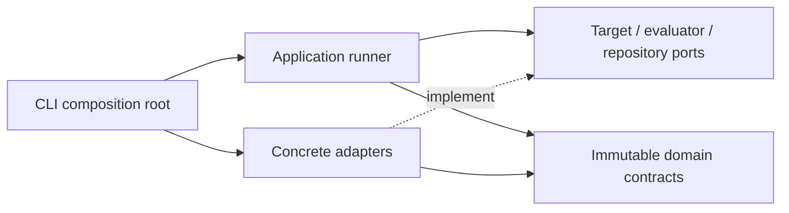
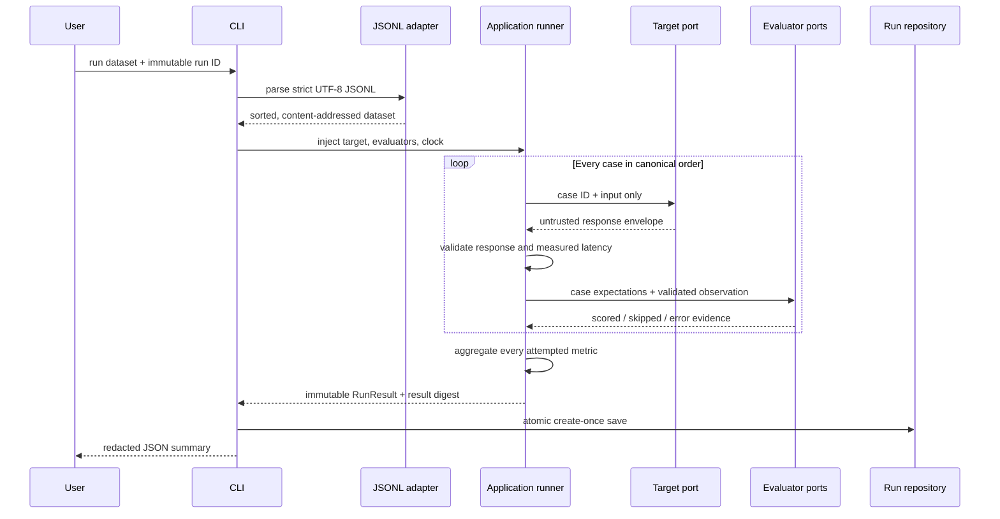

# Architecture

## System objective

LLM Eval Control Plane turns AI application behavior into reproducible evidence.
The implemented Phase 1 slice loads a content-addressed dataset, invokes a
versioned target once per case, validates untrusted responses, applies versioned
evaluators, preserves case-level outcomes, aggregates coverage-aware metrics,
and atomically stores a complete immutable run.

Candidate/baseline comparison and deterministic release-gate decisions remain
outside the current execution slice.

## Architectural style

The project is a modular monolith. The CLI is the composition root: it constructs
concrete adapters and passes them into application-owned protocol ports.



The compile-time dependency rule is:

```text
entrypoints and adapters -> application -> domain
```

The application layer does not import concrete adapters. The domain does not
import CLI, persistence, network, telemetry, queue, database, or provider SDKs.

## Implemented structure

```text
src/llm_eval_control_plane/
├── cli.py
├── application/
│   ├── ports.py           # target, evaluator, and run-repository protocols
│   └── runner.py          # serial in-process orchestration and aggregation
├── adapters/
│   ├── fake_target.py     # deterministic offline target and synthetic clock
│   ├── filesystem.py      # atomic append-only local run storage
│   ├── jsonl.py           # strict normalized dataset transport
│   └── scorers.py         # deterministic built-in evaluators
└── domain/
    ├── artifacts.py       # immutable version references
    ├── canonical.py       # strict parsing and RFC 8785 hashing
    ├── datasets.py        # reviewed cases and dataset versions
    ├── evaluation.py      # future gate specifications
    ├── execution.py       # target and evaluator result envelopes
    ├── models.py          # shared strict/frozen model behavior
    └── results.py         # case evidence, aggregates, and run digests
```

## Phase 1 execution flow



Target expectations are never passed through the target port. Target and
evaluator exceptions are converted to bounded failure codes; remaining cases
continue. The runner catches ordinary exceptions but does not swallow process
control exceptions such as cancellation or keyboard interruption.

## Determinism boundaries

- Dataset content uses RFC 8785 canonical JSON. Case and slice order are
  normalized before hashing.
- Result arrays have enforced canonical order. The result digest excludes the
  caller-selected run ID but includes outputs, observations, usage, and measured
  latency.
- The offline CLI injects a fixed-step clock so the checked-in fixture produces
  stable bytes. Its 5 ms values are synthetic and must not be presented as a
  performance benchmark.
- A future live target will use the runner's monotonic clock; measured latency
  will then intentionally change the result digest.

## Persistence contract

One complete run is stored as an RFC 8785 envelope plus exactly one LF. Run IDs
are validated before path construction and mapped to domain-separated SHA-256
filenames, avoiding traversal, reserved-name, and case-insensitive collisions.

Publishing uses a fully written same-directory temporary file and an atomic hard
link. Existing byte-identical content is an idempotent success; different valid
content is a conflict; corrupt or special files fail closed. Reads are bounded,
reject symlinks and non-regular files where the platform supports those checks,
revalidate the storage schema and domain digest, and require exact canonical
bytes.

## Trust boundaries

- Dataset lines, target outputs, schemas, and stored bytes are untrusted.
- Remote JSON Schema references are disabled; evaluation never performs schema
  network fetches.
- Credentials are absent from Phase 1. The offline target requires no environment
  variables, keys, or provider SDKs.
- Default CLI output contains bounded identifiers, digests, counts, metrics, and
  failure codes—not inputs, expectations, target outputs, or exception text.
- Local artifacts can contain evaluation content. `.llm-eval/` is ignored, and
  POSIX stores use `0700` directories and `0600` files.

## Deferred boundaries

Real target adapters, comparison and gates, PostgreSQL, durable queues, an HTTP
API, a dashboard, OpenTelemetry, authentication, and cloud infrastructure will
be introduced only with a complete vertical slice and its tests. Kubernetes,
multi-cloud abstractions, billing, and arbitrary third-party Python plugins are
outside the MVP.
