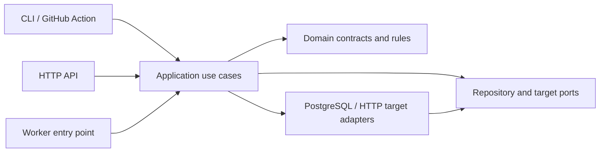
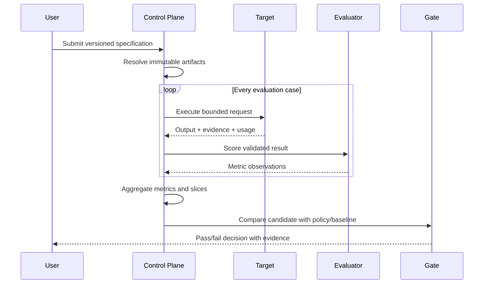

# Architecture

## System objective

LLM Eval Control Plane makes AI application releases measurable. It resolves
immutable evaluation inputs, executes a candidate and optional baseline against
the same cases, stores case-level evidence, aggregates versioned metrics, and
produces a deterministic gate decision.

## Architectural style

The project begins as a modular monolith. Process boundaries will be introduced
only when durable execution or independent scaling requires them.



The compile-time dependency rule is:

```text
entrypoints and adapters -> application -> domain
```

The domain layer must not import FastAPI, SQLAlchemy, Redis, OpenTelemetry, or
model-provider SDKs. Evaluator implementations and target integrations are
adapters; text-to-SQL and RAG are not hard-coded into the core state model.

## Current structure

```text
src/llm_eval_control_plane/
├── cli.py                 # contract inspection and validation only
└── domain/
    ├── artifacts.py       # immutable version references
    ├── evaluation.py      # metric gates and evaluation specifications
    └── models.py          # shared strict/frozen model behavior
```

Planned modules will be introduced when their first complete use case exists:

```text
src/llm_eval_control_plane/
├── application/           # orchestration and Protocol ports
├── adapters/              # target, persistence, and evaluator implementations
├── entrypoints/           # CLI, API, and worker boundaries
└── bootstrap/             # settings, logging, and dependency composition
```

## Evaluation flow



## Trust boundaries

- Target responses, documents, SQL, citations, and model-generated structures
  are untrusted.
- A target adapter may reference a credential but cannot serialize it into a run
  manifest or result.
- Default telemetry contains bounded identifiers, timings, counts, and outcome
  codes—not evaluation content.
- Deterministic fixtures run in CI. Live-provider evaluations are opt-in and do
  not determine whether ordinary unit tests pass.

## Deferred decisions

PostgreSQL, Redis-backed execution, FastAPI, React, OpenTelemetry, authentication,
and cloud infrastructure are intentionally deferred until their corresponding
vertical slice. Kubernetes, multi-cloud support, billing, and arbitrary
third-party Python plugins are outside the MVP.
