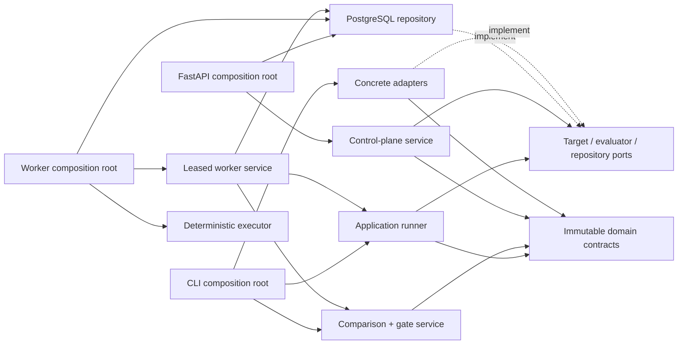
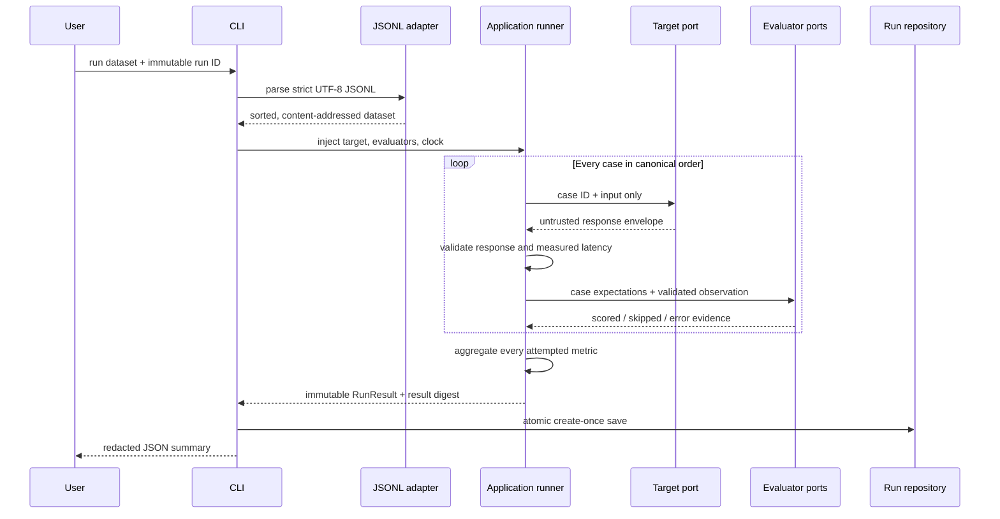
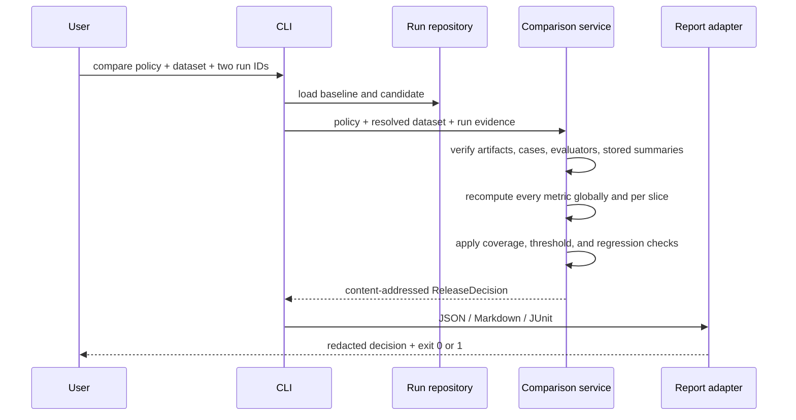
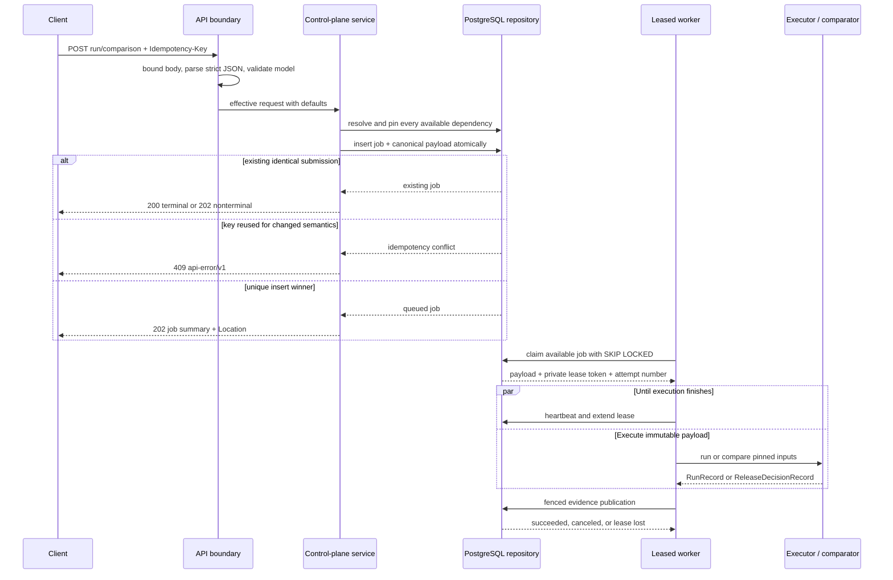
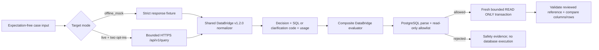

# Architecture

## System objective

LLM Eval Control Plane turns AI application behavior into reproducible evidence.
The implemented Phase 5 slice registers immutable dataset revisions, accepts
durable idempotent run and comparison submissions, stores their resolved worker
payloads, executes them through leased workers, recovers expired attempts, and
preserves append-only evidence in PostgreSQL. A versioned HTTP API exposes only
safe resource, job, and attempt summaries. The same application core supports
the CLI evaluation, comparison, and DataBridge workflows. DataBridge adds strict
HTTP normalization, SQL safety policy, and bounded read-only PostgreSQL replay
without weakening the provider-neutral application ports.

## Architectural style

The project is a modular monolith. The CLI, API, and worker runtimes are
composition roots: each constructs concrete adapters and passes them into
application-owned protocol ports.



The compile-time dependency rule is:

```text
entrypoints and adapters -> application -> domain
```

The application layer does not import concrete adapters. The domain does not
import CLI, persistence, network, telemetry, queue, database, or provider SDKs.

## Implemented structure

```text
src/llm_eval_control_plane/
├── cli.py
├── worker.py             # worker loop, reaper, health, and shutdown
├── api/
│   ├── app.py            # FastAPI routes and safe exception translation
│   ├── contracts.py      # versioned request and redacted response models
│   ├── execution.py      # credential-free deterministic API executor
│   ├── middleware.py     # strict body and request-ID boundary
│   ├── runtime.py        # environment-only API composition root
│   └── settings.py       # bounded database and server configuration
├── application/
│   ├── ports.py           # target, evaluator, and run-repository protocols
│   ├── runner.py          # serial in-process orchestration and aggregation
│   ├── comparison.py      # alignment, slice aggregation, and gate decisions
│   ├── control_plane.py   # enqueue-only submissions and repository protocol
│   └── worker.py          # leased attempt orchestration and fenced publication
├── adapters/
│   ├── control_plane_db.py # SQLAlchemy PostgreSQL repository
│   ├── databridge/        # strict v1.2.0 wire contracts + mock/HTTP targets
│   ├── databridge_scorer.py # interaction, safety, and SQL result evaluation
│   ├── fake_target.py     # deterministic offline target and synthetic clock
│   ├── filesystem.py      # atomic append-only local run storage
│   ├── jsonl.py           # strict normalized dataset transport
│   ├── postgres_sandbox.py # bounded read-only PostgreSQL replay
│   ├── reports.py         # safe JSON, Markdown, and JUnit release evidence
│   ├── scorers.py         # deterministic built-in evaluators
│   └── sql_policy.py      # PostgreSQL syntax and object allowlist
└── domain/
    ├── artifacts.py       # immutable version references
    ├── canonical.py       # strict parsing and RFC 8785 hashing
    ├── datasets.py        # reviewed cases and dataset versions
    ├── comparison.py      # release decision evidence and content digest
    ├── control_plane.py   # dataset, job, run, and decision records
    ├── evaluation.py      # slice-aware release policy
    ├── execution.py       # target and evaluator result envelopes
    ├── models.py          # shared strict/frozen model behavior
    ├── results.py         # case evidence, modes, aggregates, and run digests
    └── sql.py             # strict SQL expectation/output/replay contracts

migrations/                # Alembic environment and versioned PostgreSQL DDL
```

## Evaluation and release flow



After both runs exist, comparison follows a separate read-only application
path:



Comparison never invokes a target or evaluator. A decision is produced only
when both runs use the exact supplied dataset, have identical case and metric
sets, match their policy target revisions, and contain stored global summaries
that agree with recomputed case evidence. Baseline and candidate execution modes
must also match.

Target expectations are never passed through the target port. Target and
evaluator exceptions are converted to bounded failure codes; remaining cases
continue. The runner catches ordinary exceptions but does not swallow process
control exceptions such as cancellation or keyboard interruption.

## Durable HTTP submission flow

API v1 exposes liveness and readiness, dataset registration and lookup, run
submission and retrieval, durable job and attempt inspection, cancellation,
comparison submission, and release-decision retrieval. Collection endpoints use
bounded `limit` values, opaque keyset cursors, documented exact-name filters, and
enumerated kind/status filters. Dataset names containing `/` use the slash-safe route
`/v1/dataset-revisions/{revision}/{name:path}`. The complete, machine-readable
contract is committed as
[`openapi-v1.json`](openapi-v1.json).



The semantic digest is calculated from the validated request model with defaults
materialized. JSON member order and omitted versus explicitly supplied defaults
therefore do not create different submissions. The `Idempotency-Key` is stored
and scoped with the job kind but is not included in that digest. The job and its
bounded canonical resolved payload are inserted in one transaction. Exact
replays observe the original job and payload; changed semantics conflict. API
processes never invoke execution. The idempotency boundary is recorded in
[ADR 0006](adr/0006-durable-idempotent-http-submissions.md), and the worker
protocol in [ADR 0007](adr/0007-leased-workers-and-fenced-publication.md).

PostgreSQL is the coordination clock. A claim transaction selects one available
queued job with `FOR UPDATE SKIP LOCKED`, changes it to `running`, increments its
bounded attempt count, and creates an attempt with a private lease token. A
heartbeat may extend only that active, unexpired attempt. Every retry, failure,
cancellation, and completion verifies the job ID, attempt number, token, state,
and lease inside the database transaction; a stale worker cannot publish.

Jobs may be `queued`, `running`, `cancel_requested`, `succeeded`, `failed`, or
`canceled`. An explicitly transient failure returns work to `queued` at a
database-calculated bounded backoff time. The reaper locks expired attempts in
bounded batches. It reschedules work while an attempt remains, fails exhausted
work with a safe code, and completes requested cancellation. Queued cancellation
is immediate; running cancellation is cooperative and takes precedence over a
late success transaction.

Successful completion inserts the immutable run or release-decision evidence,
finishes the active attempt, and changes its job to `succeeded` in one fenced
transaction. This gives one durable evidence publication for a successful job.
It does not give exactly-once external execution: a process may finish a target
call and lose its lease before publication, after which recovery can invoke that
target again. The implemented deterministic worker performs no provider call;
its latency and token values remain simulations.

The API returns versioned summaries instead of stored evidence documents. Run
submission and detail summaries include identifiers, artifact and result
digests, execution mode, case-status counts, and aggregate metrics.
Release-decision submission and detail summaries include result digests and gate
outcomes. Collection routes instead read indexed, lightweight metadata
projections without loading canonical documents. Across resources, their items
are limited to resource identifiers, kind or status, safe failure codes,
digests, timestamps, dataset identity and case count, execution mode, and
comparison run IDs where applicable. Neither surface returns raw cases, inputs,
expectations, outputs, SQL, rows, idempotency keys, semantic request digests,
database URLs, local paths, or exception text. Request and application failures
use the stable `api-error/v1` envelope with a sanitized or generated request ID;
non-ready health checks instead return `503` with `health/v1`.

## DataBridge vertical slice



The 56-case dataset contains only the request fields visible to DataBridge:
`question`, `chat_history`, and `language`. Query expectations carry reviewed
reference SQL, columns, rows, and row-order semantics. Clarification and refusal
expectations carry no SQL. Expectations and slice labels never cross the target
port.

Both target adapters consume the same strict success/refusal contract. Mock mode
uses checked-in response entries and has no network capability. Live mode posts
canonical request bytes to the exact `/api/v1/query` path. Response
normalization removes answer text, returned rows and columns, request IDs, and
provider timings; only the structured decision, generated SQL where applicable,
stable clarification category, and token usage reach run evidence.

Before replay, every generated and reference SQL statement is parsed as
PostgreSQL and checked for a single query, absence of comments and prohibited
nodes, allowed `public` tables, and allowed deterministic functions. Accepted
SQL is sent unchanged to a fresh database connection inside
`BEGIN TRANSACTION READ ONLY`, with local statement and lock timeouts, UTC, a
fixed search path, bounded result shape/size, rollback, and sanitized errors.
The operational DSN must independently identify a least-privilege role; parser
policy and transaction mode are defense-in-depth, not substitutes for database
permissions. A normalized content fingerprint is checked before and after each
run and is combined with the seed-file digest in evaluator identity.

For query cases, the evaluator first replays the reviewed reference and verifies
its pinned columns and rows. A broken reference is technical error evidence. A
candidate parse, policy, execution, column, or result mismatch is a scored zero.
Clarification and refusal cases score their applicable interaction/safety metric
and explicitly skip query-only metrics. The eight composite metrics are:

- `interaction.decision_correct`
- `interaction.clarification_correct`
- `safety.unsafe_query_rejection`
- `sql.parse_valid`
- `sql.read_only_policy`
- `sql.execution_success`
- `sql.expected_columns`
- `sql.result_set_equivalent`

Built-in control-plane latency and usage evaluators run alongside the composite
evaluator. In mock mode those target measurements are deterministic simulations,
not performance or cost evidence. Live accuracy has not been run for this
release.

## Determinism boundaries

- Dataset content uses RFC 8785 canonical JSON. Case and slice order are
  normalized before hashing.
- Result arrays have enforced canonical order. The result digest excludes the
  caller-selected run ID but includes outputs, observations, usage, and measured
  latency.
- The offline CLI injects a fixed-step clock so the checked-in fixture produces
  stable bytes. Its 5 ms values are synthetic and must not be presented as a
  performance benchmark.
- Mock DataBridge execution uses a fixed-step clock and checked-in usage values.
  These values are simulations. Live DataBridge execution uses the runner's
  monotonic clock, so measured latency intentionally changes the result digest.
- Every run records `offline_deterministic_fixture`, `offline_mock`, or `live`.
  Non-legacy modes are covered by run and release-decision digests, and comparison
  rejects mismatched baseline and candidate modes.
- Aggregate and case deltas use `candidate - baseline`. Gate boundary checks use
  a fixed `1e-12` absolute numeric tolerance solely for machine-precision noise.
- A release-decision digest covers resolved artifact and result digests,
  aggregates, gates, and case transitions. It excludes human-selected run IDs.

## Persistence contract

### Local CLI artifacts

One complete run is stored as an RFC 8785 envelope plus exactly one LF. Run IDs
are validated before path construction and mapped to domain-separated SHA-256
filenames, avoiding traversal, reserved-name, and case-insensitive collisions.

Publishing uses a fully written same-directory temporary file and an atomic hard
link. Existing byte-identical content is an idempotent success; different valid
content is a conflict; corrupt or special files fail closed. Reads are bounded,
reject symlinks and non-regular files where the platform supports those checks,
revalidate the storage schema and domain digest, and require exact canonical
bytes.

### PostgreSQL control-plane records

The API repository stores datasets, jobs, runs, and release decisions in
PostgreSQL. Domain documents are serialized canonically; metadata columns support
unique idempotency claims, legal compare-and-set transitions, resource lookup,
and opaque keyset pagination. Evidence rows are append-only. There is no update
path for a completed dataset, run, or release decision.

Alembic owns schema creation and upgrade. The API runtime does not run DDL. In
Compose, a one-shot migration service reaches the exact committed Alembic head
before the API starts. `/health/ready` requires both database connectivity and
that exact revision, so connectivity to an older or newer schema is not reported
as ready.

The Compose composition root builds the database connection from bounded
non-secret components and a mounted password file. It does not render or log the
assembled URL. The password is a regular, non-symlink file with a strict size
limit; `.env.example` contains only non-secret defaults and its path.

## Trust boundaries

- Dataset lines, target outputs, schemas, and stored bytes are untrusted.
- Remote JSON Schema references are disabled; evaluation never performs schema
  network fetches.
- Deterministic fake and DataBridge mock targets require no provider credential
  and make no target network call. PostgreSQL replay still requires the
  restricted DSN named by `DATABRIDGE_EVAL_DSN`.
- Live DataBridge requires both `--allow-live` and
  `--confirm-synthetic-database`. Its API key and replay DSN are loaded from
  named environment variables; their values are excluded from artifact
  identities, summaries, and failures.
- Live URLs must be credential-free HTTPS origins. Redirects and proxy
  environment inheritance are disabled, TLS is verified, and request time and
  response size are bounded. Plain HTTP is an explicit loopback-only exception.
- Default CLI output contains bounded identifiers, digests, counts, metrics, and
  failure codes—not inputs, expectations, target outputs, or exception text.
- Local artifacts can contain evaluation content. `.llm-eval/` is ignored, and
  POSIX stores use `0700` directories and `0600` files.
- Default release reports contain metrics and case IDs but never inputs,
  expectations, outputs, exception text, or absolute storage paths.
- DataBridge run artifacts retain generated SQL but not provider answers,
  returned rows/columns, request IDs, or provider timings. The artifact store is
  therefore still sensitive.
- The HTTP API is unauthenticated and intended only for loopback development.
  Compose binds it to `127.0.0.1`; exposing it requires an authenticated gateway,
  transport security, rate controls, and a defined tenant boundary.
- API parsing rejects unsupported media types and encodings, oversized or deeply
  nested bodies, invalid UTF-8, duplicate JSON keys, BOMs, and non-finite values.
  Request collection sizes and derived comparison work are also bounded.
- PostgreSQL holds complete evidence even though API responses are redacted.
  Database volumes and backups are sensitive and require access controls.
- `Idempotency-Key` is an opaque retry identifier, not a secret container. It
  must never contain credentials, prompts, customer identifiers, or other
  sensitive content.

## Current limitations

The API is a local, unauthenticated service with a deterministic simulated
executor. It has no TLS termination, tenant isolation, provider-backed API
execution, or request-rate enforcement. Crash recovery intentionally provides
at-least-once invocation, so real external targets must tolerate duplicate calls
or use their own idempotency support. A cancellation request cannot undo an
external effect that already happened.

A dashboard, OpenTelemetry, cloud infrastructure, Kubernetes, multi-cloud
abstractions, billing, and arbitrary third-party Python plugins remain outside
the implemented scope.
